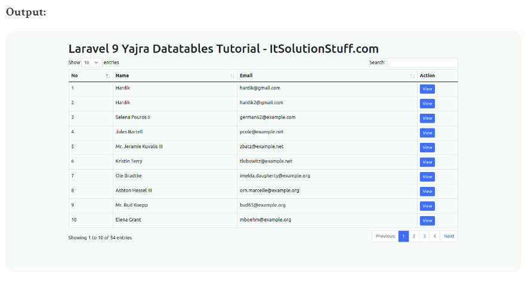

# Yajra_Datatables_Example Laravel9
Tạo mới project

```Dockerfile
composer create-project laravel/laravel Yajra_Datatables_Example
```

Trong bước này, chúng ta cần tạo  cài đặt yajra datatable thông qua  Composer, vì vậy một lệnh dưới đây của bạn là terminal và lệnh:

```Dockerfile
composer require yajra/laravel-datatables-oracle
```

Trong bước này, chúng ta cần tạo một vài users sử dụng tinker factory bằng lệnh sau 

```Dockerfile
php artisan tinker
User::factory()->count(20)->create()
```

Tạo mới một Controller tên là UserController
- app/Http/Controllers/UserController.php
```Dockerfile
<?php
   
namespace App\Http\Controllers;
  
use Illuminate\Http\Request;
use App\Models\User;
use DataTables;
  
class UserController extends Controller
{
    /**
     * Display a listing of the resource.
     *
     * @return \Illuminate\Http\Response
     */
    public function index(Request $request)
    {
        if ($request->ajax()) {
            $data = User::select('*');
            return Datatables::of($data)
                    ->addIndexColumn()
                    ->addColumn('action', function($row){
       
                            $btn = '<a href="javascript:void(0)" class="edit btn btn-primary btn-sm">View</a>';
      
                            return $btn;
                    })
                    ->rawColumns(['action'])
                    ->make(true);
        }
          
        return view('users');
    }
}
```
Thêm route mới:
Trong bước này, chúng ta cần tạo route cho các tệp dữ liệu và một tuyến khác để lấy dữ liệu. vì vậy hãy mở tệp "route / web.php" của bạn và thêm route sau.
- routes/web.php

```Dockerfile
<?php
  
use Illuminate\Support\Facades\Route;
  
use App\Http\Controllers\UserController;
  
/*
|--------------------------------------------------------------------------
| Web Routes
|--------------------------------------------------------------------------
|
| Here is where you can register web routes for your application. These
| routes are loaded by the RouteServiceProvider within a group which
| contains the "web" middleware group. Now create something great!
|
*/
  
Route::get('users', [UserController::class, 'index'])->name('users.index');
```
Create Blade File: Trong bước cuối cùng, hãy tạo users.blade.php (resource / views / users.blade.php) cho layout  và chúng ta sẽ viết code ở đây: resources/views/users.blade.php

```Dockerfile
<!DOCTYPE html>
<html>
<head>
    <title>Laravel 9 Yajra Datatables Tutorial - ItSolutionStuff.com</title>
    <meta name="csrf-token" content="{{ csrf_token() }}">
    <link href="https://cdnjs.cloudflare.com/ajax/libs/twitter-bootstrap/5.0.1/css/bootstrap.min.css" rel="stylesheet">
    <link href="https://cdn.datatables.net/1.11.4/css/dataTables.bootstrap5.min.css" rel="stylesheet">
    <script src="https://code.jquery.com/jquery-3.5.1.js"></script>  
    <script src="https://cdnjs.cloudflare.com/ajax/libs/jquery-validate/1.19.0/jquery.validate.js"></script>
    <script src="https://cdn.datatables.net/1.11.4/js/jquery.dataTables.min.js"></script>
    <script src="https://cdn.jsdelivr.net/npm/bootstrap@5.0.2/dist/js/bootstrap.bundle.min.js" integrity="sha384-MrcW6ZMFYlzcLA8Nl+NtUVF0sA7MsXsP1UyJoMp4YLEuNSfAP+JcXn/tWtIaxVXM" crossorigin="anonymous"></script>
    <script src="https://cdn.datatables.net/1.11.4/js/dataTables.bootstrap5.min.js"></script>
</head>
<body>
     
<div class="container">
    <h1>Laravel 9 Yajra Datatables Tutorial - ItSolutionStuff.com</h1>
    <table class="table table-bordered data-table">
        <thead>
            <tr>
                <th>No</th>
                <th>Name</th>
                <th>Email</th>
                <th width="100px">Action</th>
            </tr>
        </thead>
        <tbody>
        </tbody>
    </table>
</div>
     
</body>
     
<script type="text/javascript">
  $(function () {
      
    var table = $('.data-table').DataTable({
        processing: true,
        serverSide: true,
        ajax: "{{ route('users.index') }}",
        columns: [
            {data: 'id', name: 'id'},
            {data: 'name', name: 'name'},
            {data: 'email', name: 'email'},
            {data: 'action', name: 'action', orderable: false, searchable: false},
        ]
    });
      
  });
</script>
</html>
```

Tất cả các bước cần thiết đã được thực hiện, bây giờ bạn phải nhập lệnh dưới đây và nhấn enter để chạy ứng dụng Laravel:

```Dockerfile
php artisan serve
```
php artisan serve

http://localhost:8000/users





